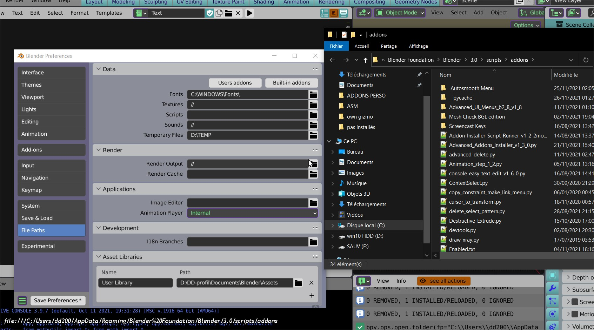

# Open-System-Browser

reorganize / edit your files quickly, without having to quit actual blender browser 
  
From any Blender Browser:  
BROWSE in your OS Browser*  Ctrl+O / context menu  
OPEN file (default appli)   ctrl+shift+O / context menu  
*to directory if no file selected, 
 else to directory with file selected (to not have to search it again ^^)  

I did this addon because sometime I realise that I wanted to move a file  
and it was so long to have to get back to OS Browser to do it...  

but the process can be used in addons too to edit quickly a file show the result filed selected (what blender don't do)...

added a shortcut to open addon folders there

  

